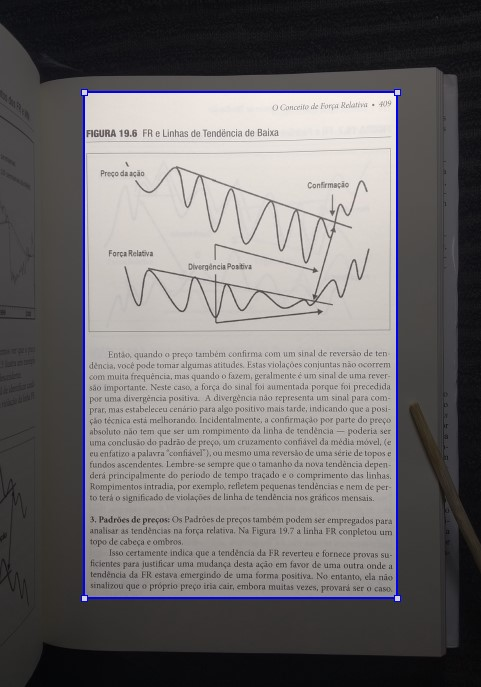
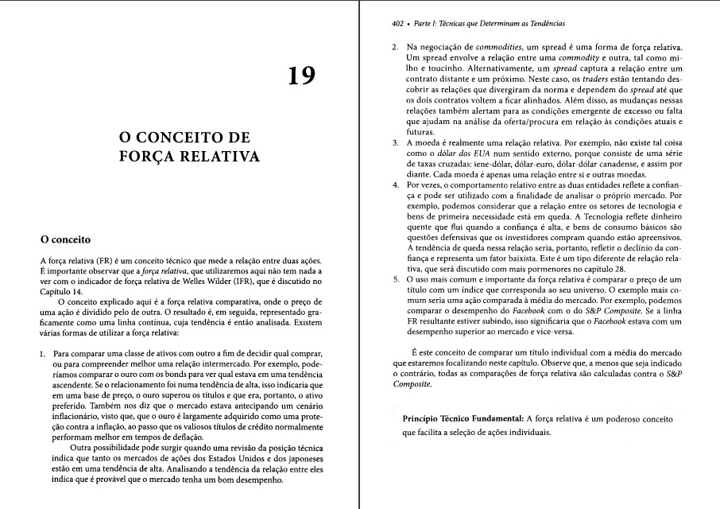
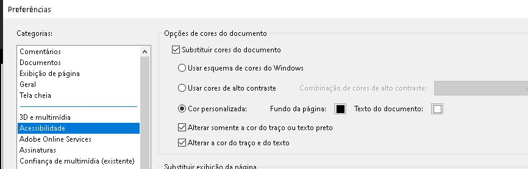
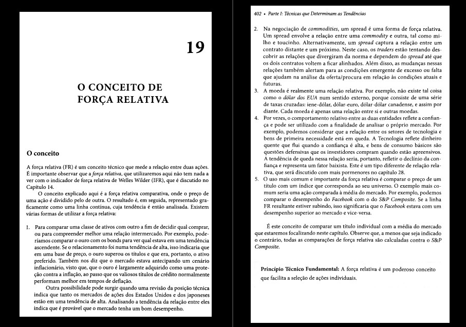

## Tutorial-Como digitalizar livros
Autor: [t.me/anonlivros](https://t.me/anonlivros)\
Versão: 101

### Menu de Navegação
1-[Introdução](#introdução)

2-[O segredo do enquadramento perfeito](#o-segredo-do-enquadramento-perfeito)

2.1-[Perspectiva](#perspectiva)

2.2-[Rotação](#rotação)

3-[Tirar Fotos-Modo Páginas Contínuas](#tirar-fotos-modo-páginas-contínuas)

4-[Tirar Fotos-Modo Duplex](#tirar-fotos-modo-duplex)

4.1-[Acelerando as fotografias](#acelerando-as-fotografias)

4.1.1-[Disparo por sinal sonoro](#disparo-por-sinal-sonoro)

4.1.2-[Disparo com timer automático](#disparo-com-timer-automático)

4.1.2.1-[Configurando o timer](#configurando-o-timer)

4.2-[Dica para aumentar a qualidade final](#dica-para-aumentar-a-qualidade-final)

4.2.1-[Minimizar distorção das páginas](#minimizar-distorção-das-páginas)

5-[Tratamento das fotos](#tratamento-das-fotos)

5.1-[Modo em lotes de páginas contínuas](#modo-em-lotes-de-páginas-contínuas)

5.2-[Modo em lotes separados em Par / Ímpar (duplex scanning)](#modo-em-lotes-separados-em-par--%c3%admpar-duplex-scanning)

5.2.1-[Corrigir rotação do lote de páginas Ímpar e Par com software externo](#corrigir-rotação-do-lote-de-páginas-ímpar-e-par-com-software-externo)

5.3-[Edição final](#edição-final)

5.3.1-[Tutorial em vídeo](#tutorial-em-vídeo)

5.3.2-[Download-Software Profissional](#download-software-profissional)

5.3.3-[Importação](#importação)

5.3.3.1-[Delimitação do tamanho da task](#delimitação-do-tamanho-da-task)

5.3.4-[Edição das fotos](#edição-das-fotos)

5.3.5-[Definindo a resolução](#definindo-a-resolu%c3%a7%c3%a3o)

5.3.6-[Recuperar a ordem natural das páginas](#recuperar-a-ordem-natural-das-páginas)

5.3.7-[Ativar função de pesquisa (OCR)](#ativar-fun%c3%a7%c3%a3o-de-pesquisa-ocr)

5.3.8-[Backup, Repetição e Sucesso](#backup-repeti%c3%a7%c3%a3o-e-sucesso)

6-[Salvar Ebook PDF](#salvar-ebook-pdf)

### Introdução
###### [[voltar]](#tutorial-como-digitalizar-livros)

\
Este tutorial ensina a transformar um Livro em Ebook PDF pesquisável.

Se trata de um método de baixo custo, mas que preza por qualidade e velocidade.

Não será necessário Scanner, mas só será utilizado:


- Celular
- Suporte de celular tipo '[Pescoço de Ganso](https://www.google.com/search?q=suporte+pesco%C3%A7o+de+ganso&tbm=isch)'

- Fonte de Iluminação extra
- Computador

Antes\


Depois\


No escaneamento de livros, existe o dilema envolvendo as variáveis: Qualidade x Velocidade

Para maior velocidade, perdendo qualidade de imagem, se fotografa 2 páginas por vez e posteriormente se divide a imagem na metade. Como é preciso uma boa distância entre o livro e o celular para enquadrar as duas páginas do livro, a qualidade da imagem não será tão boa. Este processo será chamado de Continuo ao longo do tutorial.

Para maior qualidade, se fotografa uma página por vez, com maior aproximação da câmera ao livro. Em contrapartida, este processo exige um maior tempo dedicado à captura das imagens. Este processo será chamado de Duplex.

Este tutorial abordará extensivamente um modo otimizado de praticar o processo Duplex, desde a fase inicial de captura das fotos, seguindo por sua edição até gerar o ebook PDF finalizado.

Sobre a velocidade da transformação de livro de papel em Ebook PDF.

#### Eficiência do Processo

##### Resumo
Para transformar um livro de 400 páginas em PDF pesquisável
- 4 horas de trabalho, se dividindo em:
  - 1,5 horas para tirar fotos
  - 2,5 horas para formar o PDF

A etapa da geração das fotos (.jpgs) é composta por:
- Total: 1,5 horas
  - 60 minutos - Tirar 400 fotos
  - 10 minutos - Enviar as fotos para o PC
  - 20 minutos - Tratamento dos arquivos
    - Corrigir erro de angulação
    - Renomear os arquivos
    - Conferir arquivo duplicado ou faltante

A etapa de formação do PDF é composta por:
- Total: 2,5 horas
  - 15 minutos - Por task
  - 15 segundos - Por página

Caso tenha curiosidade em entender as variáveis que afetam a eficiência do processo, continue a leitura deste tópico. Do contrário, pule para o tópico **Eficiência vs. Ergonomia**.

##### Eficiência vs. Quantidade de Tasks

**Etapa de fotografia**

A etapa de fotografia no modo Duplex com as recomendações práticas que serão explicadas em detalhes nos próximos tópicos, possui eficiência de aproximadamente `7 segundos por página`.

Assim, para fotografar um livro de 400 páginas no modo Duplex, seria necessário uma sessão por volta de 25 minutos para fotografar as 200 páginas pares, seguida de outra sessão com a mesma duração para fotografar as 200 páginas ímpares.

Como 25 minutos é um limite ergonomicamente seguro para repetir este trabalho manual, é recomendado utilizar 200 páginas como limite de fotos contínuas antes de uma pausa, possibilitando assim, Tasks de 400 fotos (200 do lote ímpar e 200 do lote par).

O conceito de Task será apresentado e amplamente utilizado nos próximos tópicos.

**Etapa de formação do PDF**

A etapa de formação do PDF é composta por uma série de passos cujo tempo total de trabalho é fortemente influenciado pela quantidade de Tasks de trabalho das fotos.

A Task de trabalho das fotos se refere ao conjunto de fotos tirada com o suporte fixo sem mover o livro, o suporte ou o celular.

A delimitação desse conjunto de fotos com essas semelhanças entre si, mesma posição do livro, suporte e celular, é necessária para que futuramente na etapa de edição das fotos, o processo possa ser fortemente acelerado.

A aceleração do processo de edição de fotos se dá pela capacidade de se fazer Edição em Lote. Ou seja, ao configurar uma série de efeitos numa página modelo do conjunto de fotos de um lote de uma Task, haverá a segurança de que as demais páginas do conjunto receberão o efeito de forma apropriada, pois as imagens das páginas estão na mesma posição e perspectiva.

Como exemplo, caso um livro de 400 páginas seja fotografado em 4 momentos diferentes, com 100 fotos por sessão, então haverá 4 Tasks independentes no processo de Edição.

A estimativa de conclusão do trabalho de edição das fotos e formação do PDF, é de 15 minutos por Task + 15 segundos por página.

##### Tabela: Estimativas de Tempo vs. Quantidade de Tasks
| qt. tasks | páginas por Task | tempo_total | tempo_task | tempo_configuração | tempo_edição |
|-----------|------------------|-------------|------------|--------------------|--------------|
| 8         | 50               | 220         | 27,5       | 15                 | 12,5         |
| 4         | 100              | 160         | 40         | 15                 | 25           |
| 2         | 200              | 130         | 65         | 15                 | 50           |
| 1         | 400              | 115         | 115        | 15                 | 100          |

Legenda:\
tempo_configuração = 15 minutos\
tempo_edição (por task) = 15 segundos * "Páginas por Task"\
tempo_task = tempo_configuração + tempo_edição\
Tempo para formação do PDF = tempo_task * "qt. tasks"

Fórmula da duração total do processo de edição:\
`("15 minutos" * "Qt. tasks") + ("qt. páginas do livro" * "15 segundos")`

##### Eficiência vs. Ergonomia

Considerando tudo o que foi explicado neste tópico, fica evidente que o cenário mais eficiente é alcançado ao fotografar todo o livro em 1 única sessão, formando uma única Task composta por apenas 2 lotes (par e ímpar).

Mas para cumprir esse objetivo, o trabalho pode ser fisicamente pesado e ergonomicamente arriscado, visto que para fotografar um livro de 800 páginas em 1 Task, seria necessário fotografar o lote par sem tirar as mãos do livro por 50 minutos contínuos, fazer uma pausa e repetir o processo de 50 minutos contínuos para o lote ímpar.

Como 50 minutos é tempo demais para um atividade manual que se repete a cada 7 segundos, o limite recomendado é trabalhar com Tasks de 400 páginas (200 par e 200 ímpar), que dura 25 minutos de trabalho repetitivo por lote.

#### Iluminação

Uma fonte de iluminação extra é necessária para evitar que a sombra causada pelo celular ou uma baixa iluminação do ambiente cause distorção na imagem.

Como fonte de iluminação, pode ser utilizado o LED ligado de um outro celular ou uma [Luminária de Mesa](https://www.google.com/search?q=lumin%C3%A1ria+de+mesa&tbm=isch&).

### O segredo do enquadramento perfeito
###### [[voltar]](#tutorial-como-digitalizar-livros)

\
O processo de tirar fotos com um celular, ao invés de um aparelho de Scanner, está sujeito a distorções:
- de perspectiva, que impede que os ângulos internos de uma foto de um retângulo seja de 90 graus.
- de rotação, quando o livro está levemente rotacionado na mesa em relação ao celular.

Apesar de que essas distorções nas fotografias possam ser atenuadas com técnicas de edição gráfica, a qualidade final do processo será **inferior** do que seria caso a etapa de captura das fotos já fosse com enquadramento perfeito.

Um enquadramento perfeito da captura das fotos contribui imensamente para a qualidade final do ebook PDF.

Abaixo será explicado como podemos atingir este nível de qualidade.

Executar esses passos com cuidado, minimiza drasticamente o tempo necessário na edição das fotos, por reduzir o tempo gasto com configuração para compensar a distorção trapezoidal, como também o tempo gasto com ajuste de rotação das páginas.

#### Perspectiva
###### [[voltar]](#tutorial-como-digitalizar-livros)

\
Siga os passos:
- Instale o Android app `Angle Measurement and Accelerometer`\
https://play.google.com/store/apps/details?id=com.tksw.tksw.anglemeasurement
- Coloque o celular em cima da mesa onde o livro será fotografado. Caso o celular tenha alguma capa que desnivele a face do celular em cima da mesa, remova a capa.
- Abra o app e memorize as coordenadas X e Y que aparecem na tela do app.
- Prenda o suporte à mesa, preferencialmente próximo da quina da mesa, onde você possa manusear o livro sem inclinar o tronco ou estender os braços.
- Prenda o celular no suporte.
- Ajuste o suporte e a posição do celular nele, de modo que as coordenadas para X e Y no app, fiquem o mais próximas possíveis das coordenadas que foram memorizadas anteriormente.

Com esses passos acima, garantimos que as páginas capturadas estejam sem distorção de perspectiva, onde os ângulo internos sejam de exatos 90 graus.

#### Rotação
###### [[voltar]](#tutorial-como-digitalizar-livros)

\
Siga os passos:
- Abra o app da sua câmera com a opção `Linhas de Grade`ou `Grid Lines` ativada.
- Ajuste a posição do livro na mesa se guiando pelas linhas de grade.
	- De modo que o livro fique com as linhas de texto ajustadas com as linhas horizontais da grade.
	- E de modo que o livro fique centralizado na área visível da câmera.

Com esses passos acima, garantimos que:
- o livro esteja aprumado com a posição do celular e assim, as linhas sejam fotografadas perfeitamente horizontais.
- As margens verticais e horizontais dos limites da foto em relação ao livro, estejam simétricas.

### Tirar Fotos-Modo Páginas Contínuas
###### [[voltar]](#tutorial-como-digitalizar-livros)

\
[ em construção ]

### Tirar Fotos-Modo Duplex
###### [[voltar]](#tutorial-como-digitalizar-livros)

\
Para colher as duas vantagens (qualidade e velocidade) simultaneamente, recomenda-se o uso de um suporte fixo para segurar a câmera.

A técnica recomendada consiste em manter o suporte apontando a câmera apenas para a página da direita, enquadrando toda a página da forma mais próxima possível, aproximando a câmera de modo a minimizar  espaços vazios nas margens da foto.

Para facilitar a comunicação de termos, chamaremos as páginas da direita do livro como 'ímpar' e as páginas da esquerda como 'par'.

Após o devido enquadramento fixo, por estar presa no suporte, fotografar todas as páginas Ímpares sem movimentar o livro, mas somente virando as páginas.

Após o término da fotografia do lote Ímpar, recomenda-se virar o livro de ponta-cabeça (giro de 180 graus) e fotografar apenas as páginas Par. O motivo do 'giro 180 graus' é para ser possível  focalizar apenas as páginas Pares, mas sem precisar ajustar o enquadramento do suporte do celular.

Durante esse giro, reaplique a técnica de ajuste de rotação com as linhas de grade, descrito no início do tutorial.

Após girar o livro 180 graus, existe uma forma de tornar as 'viradas de páginas' mais cômodas. Recomenda-se fotografar começando da última página do livro, assim os movimentos das mãos em virar as páginas serão os mesmos em relação ao lote Ímpar.

Naturalmente, as fotografias deste lote ficarão de ponta cabeça e em ordem inversa de páginas, mas posteriormente esse efeito colateral será ajustado.

É importante lembrar para o uso de uma fonte de iluminação extra, evitando que baixa iluminação ou sombras distorçam a imagem.

#### Acelerando as fotografias
###### [[voltar]](#tutorial-como-digitalizar-livros)

\
Para aumentar a velocidade de captura sem precisar tocar no celular para tirar cada foto, existem abordagens distintas que podem ser seguidas.
Além do ganho de velocidade, essas abordagens aumentam a qualidade das fotos, uma vez que o toque no celular provoca tremores no suporte que podem gerar borrões na foto.

##### Disparo por sinal sonoro
###### [[voltar]](#tutorial-como-digitalizar-livros)

\
Esta abordagem é a mais eficiente. Mas ela só pode ser aplicada em ambientes que não sejam muito barulhentos.

- Instale o android app EasySelfie\
https://play.google.com/store/apps/details?id=com.pojkarsoft.easyselfie

O app informado possibilita tirar fotos sempre que o seu celular 'escutar' um ruído acima de um volume predeterminado. Desta forma, basta pronunciar uma sílaba em voz alta, como 'vai' ou 'pá', que o celular fará o disparo da fotografia.

Em seguida, virar a página do livro e emitir novamente o sinal sonoro para o celular tirar mais uma foto.

> Importante: Se tiver alguém no ambiente, avise do processo para não acharem que você perdeu o juízo em ficar falando 'pá-pá-pá' a cada 5 segundos. :p

A grande vantagem deste método está em o celular respeitar as variações de velocidade na sua capacidade de virar as páginas. Assim haverá uma forte sincronia entre a frequência das fotografias disparadas e seus movimentos manuais. Sem disparo no momento errado e sem tempo perdido com espera.

##### Disparo com timer automático
###### [[voltar]](#tutorial-como-digitalizar-livros)

\
Esta abordagem é menos produtiva que com o Disparo por Sinal Sonoro.

- Instale o android app Câmera Foto Sequência\
https://play.google.com/store/apps/details?id=com.augusto.cameratimelapse&hl=pt_BR

O app informado possibilita tirar fotos automaticamente a cada 'x' segundos, de forma que o tempo dos intervalos de captura corresponda a sua pessoal velocidade manual de trocar de páginas com segurança, minimizando os erros no processo.

###### Configurando o timer
###### [[voltar]](#tutorial-como-digitalizar-livros)

\
- Testar o timer de fotografia sequencial configurado para 10 segundos e ir reduzindo conforme a sua perícia em virar páginas com segurança e rapidamente.
- É importante destacar que caso o timer seja configurado para um tempo abaixo de sua habilidade manual em trocar páginas, resultará mais erros manuais. Ou seja, erros como tiragem de foto durante o manuseio das páginas. Esses erros demandam maior retrabalho de exclusão das fotos descartáveis e ocasionam no aumento do tempo investido no processo de captura. Assim, é importante configurar um tempo de captura sequencial que esteja de acordo com sua particular habilidade de virar páginas.

#### Dica para aumentar a qualidade final
##### Minimizar distorção das páginas
###### [[voltar]](#tutorial-como-digitalizar-livros)

\
Siga os passos:
- Para livros do tipo brochura que causa arredondamento de páginas durante sua abertura, é recomendável usar um instrumento longo e fino para pressionar as páginas fotografadas minimizando o 'arredondamento' delas durante a captura e se aproximando de um estado perfeitamente 'assentado' das páginas.
- O local indicado de pressão é a margem externa do livro, o mais longe possível de seu conteúdo.
- O instrumento para aplicar pressão pode ser improvisado com objetos como:
	- Hashi de sushi, baqueta de bateria, régua, garfo/colher (apoiando no livro com o cabo), cabo fino de pentes/escovas longas, etc...
	- Uma abordagem não recomendada seria estabilizar as páginas com os próprios dedos pressionando na margem. Mas dessa forma, aumenta a chance de gerar piores resultados durante o processamento automático de correção de distorções.

## Tratamento das fotos
### Modo em lotes de páginas contínuas
###### [[voltar]](#tutorial-como-digitalizar-livros)

\
[ em construção ]
- Similar ao processo duplex, com as ressalvas:
	- É necessário cortar as fotos verticalmente, na divisão das páginas.
	- Não é necessário fazer o reordenamento em modo 'duplex scanning'

### Modo em lotes separados em Par / Ímpar (duplex scanning)
###### [[voltar]](#tutorial-como-digitalizar-livros)

\
Este método considera que se tenha um lote de imagens apenas das páginas **ímpar** e outro lote de imagens apenas com páginas **par**.

A Eficiência Estimada do processo de edição proposto é de aproximadamente 15 segundos por página, acrescido de 15 minutos por Task.

#### Corrigir rotação do lote de páginas Ímpar e Par com software externo
[ em construção ]

### Edição final
###### [[voltar]](#tutorial-como-digitalizar-livros)

\
Utilizaremos o software `Abby FineReader 15 Portable` para fazer a edição final das fotos e produzir o livro em PDF.

#### Tutorial em vídeo
###### [[voltar]](#tutorial-como-digitalizar-livros)

\
[](https://youtu.be/8U1QuFpO8WY)

#### Download-Software Profissional

**abby_finereader_15-portable - version 15018AFRCE**\
https://t.me/anonlivros/18


#### Importação
###### [[voltar]](#tutorial-como-digitalizar-livros)

\
Primeiro é preciso configurar previamente o software.

Siga os passos:
- Crie um novo projeto do Abbyy Finereader acessando o menu superior, seguindo os passos:
  - `File` > `New OCR Project`
- Desabilite o processamento automático de imagens, seguindo os passos:
  - `Tools` > `Options` > `Image Processing`
  - Desabilite o tickbox `Automatically process page`, confirme clicando no botão `OK`


##### Reconhecendo o Tamanho da Task
###### [[voltar]](#tutorial-como-digitalizar-livros)

A velocidade do processo de edição das fotos das páginas dependerá do tamanho da Task do processo de fotografia.

Tal como explicado no tópico `Eficiência vs. Quantidade de Tasks`, o conjunto de fotos tirada em mesma posição do celular e livro, forma um lote (par ou ímpar). E o conjunto destes dois lotes forma uma Task.

As Tasks devem ser arquivadas em pastas independentes, pois sua importação em momentos distintos acelerará o processo de edição das fotos das páginas.

Cada Task devem possui um volume Par, considerando que os 2 lotes (par e ímpar) que a compõe possui o mesmo volume de páginas.

Como o projeto de construção do PDF não será finalizado num único esforço contínuo, a atividade edição final das fotos de uma Task será quebrada em várias sessões de trabalho.

Em outras palavras, o trabalho de edição das fotos de uma Task naturalmente poderá ser fragmentado dependendo do tempo disponível do editor, mas é extremamente recomendado que se faça um backup do projeto entre essas pausas no processo de edição.

Maiores explicações sobre a importância do processo de Backup e recomendações sobre como o executar, serão abordadas mais adiante.

###### Resumo do fluxo de trabalho

- Etapa em ciclo
  - Importar lote Ímpar da Task 1
  - Editar lote Ímpar da Task 1, fragmentando em quantas sessões de trabalho forem necessárias
    - Fazer Backup do projeto a cada sessão de trabalho
  - Importar lote Par da Task 1
  - Editar lote Par da Task 1, fragmentando em quantas sessões de trabalho forem necessárias
    - Fazer Backup do projeto a cada sessão de trabalho
  - Reordenar páginas para um modo sequencial
  - Fazer Backup do projeto

- Etapa final
  - Repetir os passos acima para demais Tasks
  - Importar e editar Capa, páginas extras
  - Fazer Backup do projeto
  - Ativar Seleção e Função de Pesquisa (OCR)
  - Gerar PDF

#### Edição das fotos
###### [[voltar]](#tutorial-como-digitalizar-livros)

Considerando que as páginas iniciam no número 1.

##### Definindo a resolução padrão
###### [[voltar]](#tutorial-como-digitalizar-livros)

\
A resolução do ebook é ajustada de modo que a dimensão padronizada da página se encaixe perfeitamente na imagem dela.

**Etapa 1**
- Importe 1 única foto com texto do seu livro, arrastando o arquivo para dentro do app
- Selecione a página clicando em sua miniatura
- Clique em `Edit Image`

**Etapa 2**
- Na ferramenta `Resolution`, a defina como 200 apenas como ponto de partida
- Acesse ferramenta `Crop` (máscara de corte)
- Escolha a opção `A4`
- Caso a máscara de corte esteja grande demais para a página, repita os passos da `Etapa 2` diminuindo a resolução
- Caso a máscara de corte esteja pequena demais para a página, repita os passos da `Etapa 2` aumentando a resolução

**A4 é o melhor formato?**

A maioria dos livros são de formato A4, mas é necessário conferir.

Ao centralizar a máscara de corte na página, caso as margens verticais estejam muito maiores que as margens horizontais, pode ser que seu livro seja de formato Carta (Letter).

Repita o processo para o padrão `Letter` e verifique se as margens verticais e horizontais ficam de tamanho mais parecido.

A opção que gerar resultados mais equilibrados, será a que deve ser usada neste livro.

No caso da página ilustrada pelas duas imagens abaixo, claramente o formato A4 gera margens verticais e horizontais mais equilibradas entre si do que o formato Letter.

A4 - Resolução 220\


Letter - Resolução 230\


Tendo encontrado a resolução e formato ideal para o formato de seu livro, guarde bem essas informações pois todas as Tasks deverão ser configuradas a partir desse número de resolução e formato de página, bem como o processo de salvamento do PDF será configurado a partir dessas informações.

Caso seu interesse seja prezar por mais velocidade à estética, leia o tópico "Acelerando 5x com HardCrop" antes de seguir o passo-a-passo abaixo.

##### Resumo do processo de edição

- `Correct Trapezoid Distortion`
- `Crop` (HardCrop)
- `Deskew`
- `Straighten Text Lines`
- `Photo Correction` > `Reduce ISO Noise`
- `Photo Correction` > `White Background`
- Limpar sujeiras de cada página com a borracha `Erase`

##### Passo a passo da edição:

- Lote Ímpar da Task 1
  - Selecionar os arquivos correspondentes ao Lote Ímpar da Task 1
  - Arrastar para dentro do app, o importando
  - Para todas as páginas do lote

**Correção da Distorção Trapezoidal**
- _
    - Aplicar função: `Correct Trapezoid Distortion`
      	- Altere a máscara de modo a ensinar para o app, como a página está atualmente posicionada através da representação de um retângulo distorcido.
      	- Dessa forma, é necessário simular na máscara retangular, a mesma distorção existente na página.
      	- Dicas para simular a distorção das páginas na máscara:
          	- Visualização: Aplicar Zoom de modo que as margens horizontais da foto se ajustem aos limites do app.
          	- Navegação: Quando necessitar mover a tela verticalmente, usar os botões `[PgUp]` e `[PgDown]`. Assim reduz o risco de pular a página acidentalmente, o que ocorre caso use o Scroll do mouse.
          	- As margens da máscara não devem tocar o texto, pois elas têm efeito de Crop.
          	- No topo da página, se certifique de que uma linha horizontal interna toque uma linha de texto e permaneça paralela ao texto ao longo de toda a linha. Faça este ajuste movendo os vértices superiores.
          	- Ainda no topo da página, verifique se a linha vertical interna mais próxima do parágrafo da esquerda toca o parágrafo e permanece com essa mesma distância de margem ao longo de todo o percurso vertical, da base ao topo. Faça este ajuste movendo os vértices superiores e inferiores da esquerda.
          	- Repita o passo acima para a linha vertical interna mais próxima do parágrafo da direita. Faça este ajuste movendo os superiores e inferiores da direita.
          	- Na base da página, repita os passos de acordo com o que foi realizado no topo. Dessa vez se certifique de que uma das últimas linhas de texto fique perfeitamente paralela a uma das últimas linhas horizontais internas da máscara. Faça este ajuste movendo os vértices inferiores.
          	- Como linhas internas de referência, recomenda-se utilizar a segunda e penúltima. Sejam as horizontais de cima para baixo e de baixo para cima. Seja as verticais da esquerda para a direita e da direita para a esquerda.
      	- Atentar para manter a margem dos limites da máscara, confortavelmente maior que o conteúdo do livro desta página de referência e das demais páginas do lote.
      	- Quanto estiver satisfeito com o enquadramento e tamanho da máscara, certifique-se que todas as páginas do lote estão selecionadas e confirme clicando no botão `Correct`. Desta forma a imagem será alterada de modo que o retângulo distorcido (trapézio), se torne um retângulo de fato, com os 4 ângulos de 90 graus. Assim, estará simulado o efeito da perspectiva perfeita, similar aos Scanners profissionais.
      	- Importante: Margem curta demais em relação a página, aumenta o risco de gerar um grave erro, impossibilitando cumprir a etapa de Crop.
      	- Nota: Quanto melhor tiver sido o Enquadramento durante o processo de captura das fotos, menor será a necessidade de ajuste com essa função.

Demonstração da máscara de Distorção Trapezoidal\


**Máscara de corte**
- _
	- Selecionar função: `Crop`
      - Ajustar a margem do Crop para o menor tamanho possível sem que a margem toque no conteúdo da página (HardCrop)
      - Navegar pelas páginas do lote e ampliar alguma margem sempre que notar que ela tocou no conteúdo de alguma página, de modo a garantir que o tamanho da máscara de corte seja o menor possível ao passo que não interfere no conteúdo de todas as páginas do lote.
      - Aplicar a função `Crop`
      - Nota: Por o processo de captura das fotos do Lote ter sido realizado com suporte fixo da câmera, a variação da posição do conteúdo das páginas será bem pequena, mas existente. Caso o processo de captura das fotos tivesse sido realizado 'à mão livre', essa aceleração por HardCrop seria impraticável.

Máscara de Corte no HardCrop\


- _
  - _
    - Aplicar função: `Deskew`
    - Aplicar função: `Straighten Text Lines`
    - Aplicar função: `Photo Correction` > `Reduce ISO Noise`
  	- Aplicar função: `Photo Correction` > `White Background`

**Últimos ajustes**
- _
  - Para cada página individualmente
    - Selecionar função `Erase`
      - Manualmente limpar as margens das páginas, removendo qualquer sujeira visual, como o instrumento utilizado para pressionar as páginas ou sombras.
      - Com a ferramenta, faça retângulos largos de modo que a maior área interna seja preenchida pelo fundo do livro. Se os retângulos forem pequenos e a maior parte de sua área interna for preenchida pela sujeira a ser removida, ao invés de remover a sujeira, ocasionará um efeito colateral, aparecendo um retângulo preto.
    - Validar se há algum problema de distorção
      - Problemas e correções:
      	- Caso alguma página esteja levemente distorcida experimente aplicar a função `Remove Geometrical Distortion`
      	- Caso não se corrija, exista uma grave distorção, algum conteúdo cortado, siga os passos:
      	- Selecionar a página anterior à distorcida
      	- Em seguida selecionar a página distorcida
      	- Importar a foto original da página defeituosa
        	- Nota: A seleção sequencial da "página anterior" seguida da "defeituosa" serve para garantir que a página importada fique na posição correta. Sendo ela imediatamente após a página defeituosa.
      	- Aplicar apenas para esta página, as funções na ordem:
        	- `Crop`: Mais estreito possível
        	- `Deskew`
        	- `Straighten Text Lines`
            	- Nota: Caso a página tenha muitas imagens, talvez essa função cause distorção. Sendo assim, volte o efeito com [Ctrl]+[Z]
        	- `Photo Correction`
            	- `Remove Geometrical Distortions`
                  	- Nota: Caso distorça, volte o efeito com [Ctrl]+[Z]
            	- `Reduce ISO Noise`
            	- `White Background`

- Repetir processo acima para o lote Par

#### Backup, Repetição e Sucesso
###### [[voltar]](#tutorial-como-digitalizar-livros)

Durante o uso do app, seu projeto corre alguns riscos
- Queda de energia elétrica que corrompa o projeto
- Eventualmente o app pode travar, o forçando a fechar e depois notar que ele não abre mais, foi corrompido.
- Aplicar um Crop acidental incorreto para todas as páginas
- Ter alguma página fora de ordem ou duplicada, fazendo com que a aplicação da função de reordenamento de páginas cause um caos em todo o projeto com centenas de páginas. Este é o risco mais frequente.
- Enfim, a lista de riscos é longa...

Para minimizar o potencial de dano desses riscos ao seu projeto, é recomendado fazer um Backup sempre que finalizar um Lote.

Assim:
- Caso precise desligar o PC antes de finalizar um Lote, faça um backup
- Ao finalizar o Lote Ímpar, faça um backup
- Ao finalizar o Lote Par, faça outro backup
- Após `recuperar a ordem natural das páginas`, finalizando uma Task, faça um backup

Para fazer Backup do seu projeto, siga os passos:

Se for a primeira Task, save o projeto:
  - `File` > `Save OCR Project`
  - Selecione uma pasta adequada, defina um nome para seu projeto e o salve
  - Nota: Para demais tasks, não será necessário salvar o projeto manualmente, pois esse processo será automático.

Aplicando o Backup:
- Feche o app.
- Acesse a pasta onde o projeto foi salvo
- Note que o projeto não é um arquivo, mas sim uma pasta com ícone customizado
- Faça backup dessa pasta, tirando uma cópia dela, colando a cópia numa pasta chamada `backup` e renomeando a pasta copiada de forma identificável.
  - Exemplos:
    - 01-projeto_ate_200_impar
    - 02-projeto_ate_200_par
      - Este contém as páginas do lote impar embutido
    - 03-projeto_ate_200
      - Este é a versão após o reordenamento de páginas
    - 04-projeto_ate_400_impar
	- 05-projeto_ate_400_par
    - 06-projeto_ate_400
      - Este é a versão finalizada do livro de 400 páginas

Repita os passos do Backup sempre que finalizar um Lote, assim caso seu projeto corrompa ou sofra um grave dano, será possível recuperar o projeto estável do último Backup.

Ter Backup das últimas 2 Tasks é mais do que suficiente. Não precisa manter o backup de todas as tasks ao longo do livro. Apague os mais antigos na medida que for avançando no projeto.

O cumprimento deste contínuo processo de Backup pode ser a prática mais importante que garantirá o término do projeto com sucesso, evitando que você desista pelo caminho por causa de um acidente que o leve a jogar todo o trabalho no lixo.

#### Recuperar a ordem natural das páginas
###### [[voltar]](#tutorial-como-digitalizar-livros)

Esta etapa só é necessária para fotos importadas separando em lote Ímpar e Par (duplex).

- Para ambos os lotes
	- Selecionar as páginas,
	- clicar com o botão direito numa delas,
	- clicar na opção `Reorder pages`,
	- clicar no tickbox `Restore original page order after duplex scanning`
	- clicar no botão `Ok`.

#### Importar Capa e páginas extras

Ao importar a Capa, contracapa e demais páginas extras vindas de fontes externas, não sendo fotografadas neste projeto, comumente haverá uma incompatibilidade de resolução dessas imagens em relação às páginas  fotografadas.

Para que as páginas fotografadas e estas páginas extras possam conviver com o mesmo layout, é necessário fazer um processo de identificação independente da resolução ideal para o formato de página (digamos, A4) do ebook.

Assim, repita o processo do tópico `Definindo a resolução` para cada página vinda de fonte externa ao processo de fotografia (seja capa, contra capa ou páginas extras), e aplique a resolução ideal encontrada para cada uma dessas páginas de forma independente.

Por fim, aplique um `Crop` em formato de página para centralizar cada página vinda de fonte externa.


#### Ativar Seleção e Função de Pesquisa (OCR)
###### [[voltar]](#tutorial-como-digitalizar-livros)

Após finalizar todas as Tasks e o livro estiver finalizado no app, chegou a etapa de identificar os textos, de modo que eles sejam selecionáveis e pesquisáveis.

Siga os passos:

- Para todas as páginas:
  - Por segurança, certifique-se que todas as páginas estão com a mesma resolução padronizada.
  - Aplicar função: `Resolution`
    - Selecionar a resolução definida no tópico `Definindo a resolução` e aplicar

- Analisar páginas para distinguir texto de imagens
	- Selecionar todas as páginas
	- Clicar no botão `Analyze Page`

- Aplicar identificação de texto
	- Selecionar todas as páginas
	- Clicar no botão `Recognize Page`

**Investindo tempo para melhorar o OCR**
Apesar da identificação automática de texto ser de ótima qualidade, opcionalmente para garantir que nenhuma frase ou palavra será deixada de fora na identificação digital do texto, os passos a seguir podem ser aplicados:

Para cada página individualmente:
- Correção da identificação do que é texto (OCR)
	- Verificar cada página para se certificar que todos os campos de texto possuem um retângulo Verde ao seu entorno
	- Caso não possua
		- deve-se o criar ao clicar no 'canto superior esquerdo' e arrastar o mouse até seu canto 'inferior direito'
		- ou deve-se alongar a área de texto já existente mais próxima

## Salvar Ebook PDF
###### [[voltar]](#tutorial-como-digitalizar-livros)

\
Após a finalização do processo de edição, enfim iremos salvar o Ebook em PDF.

Siga os passos:
- Na barra de opções superior, clicar em `File`
- Clicar `Save  As`
- Clicar em `Searchable PDF Document`
- Clicar em `Options...`
- Em `Image quality`, selecione `Best quality`
- Marque `Create PDF/UA (requires OCR)`
- Clique em `Use one paper size for all page images:`
    - Na caixa de seleção que será habilitada, selecione o formato da página determinado na etapa `Definindo a resolução`
- Marque `Use MRC compression (requires OCR)`
- Marque `Apply ABBYY PreciseScan to smooth characters on page images`
- Em `Searchable PDF settings`, marque `Text under the page image`
- Clique em `Edit Metadata`
- Na tela que abrir, defina informa o título do livro, autor e opcionalmente demais informações. Confirme clicando em `Ok`.
- Confirme clicando em `Ok`
- Defina o nome para o nome do arquivo PDF e clique em `Salvar`.

## Indo além-O porquê das escolhas

### O custo estético do HardCrop

O processo de Crop anteriormente aplicado é agressivo (HardCrop), menor que o tamanho padrão da página, para reduzir o risco do aparecimento das sujeiras de borda.

Assim, a grande maioria das páginas não precisarão mais de aplicação da ferramenta `Erase` para apagar as sujeira visuais nas bordas, reduzindo drasticamente o tempo total de trabalho.

Sem o uso do HardCrop, ao invés de 400 páginas por hora, o processo de edição só renderia 80 páginas por hora.

Esta abordagem não causa prejuízo à padronização do Ebook, pois no processo do salvamento, as páginas serão centralizadas e terão seu tamanho padronizado.

A desvantagem estética desse processo acelerado consiste em o PDF ficar com ausência de fundo no entorno do conteúdo escrito. Essa ausência de fundo se mistura bem ao fundo branco da página, mas caso o leitor de PDF aplique a função de substituição de cores, essa ausência de fundo se torna gritante.

A seguir, é exemplificado essa desvantagem estética.

**Efeito colateral do HardCrop visualizado pelo Adobe Acrobat Reader**

Sem substituição de cores\


Ajustando substituição de cores


Após substituição de cores\


### Maiores explicações sobre o fluxo de processo recomendado

[ em construção ]
- Por que a mudança de resolução é aplicada apenas ao final?
- Por que `Remove Geometrical Distortion` não é aplicado à todas as páginas?
- Por que não usar `Preprocessing`?

### Considerações Finais

Se este tutorial foi útil para você, demonstre seu agradecimento compartilhando a mensagem abaixo em suas redes sociais e usando a hashtag #AnonLivros

```
Aprenda a digitalizar livros com celular
> Livro de 400 páginas em só 4 horas

Acesse: https://github.com/anonlivros/anonlivros

Autor: t.me/AnonLivros

#AnonLivros
```

Ajude a universalizar os livros e a popularizar campanhas de financiamento coletivo aos autores e as editoras.

Autores e as Editoras podem e devem lucrar com seu trabalho, mas sem praticar agressão como método. Sem praticar agressão contra o mundo dos indivíduos livres que fazem cópias livres.

Deste modo, faça sua parte para que essa transformação seja o mais confortável possível aos produtores de conteúdo digital:

Ajude os autores e as editoras. Doe e divulgue as campanhas de financiamento coletivo dos autores e das editoras. Mostre que o mundo do financiamento voluntário sustenta o modelo de negócios de produção de material digital.

Se você é autor ou possui uma editora, crie canais de financiamento coletivo e voluntário. Anexe o link desses canais aos seus livros e seus sites. Faça desta prática, o novo normal.

A abolição do mito da propriedade intelectual é um destino inevitável com o avanço contínuo da tecnologia digital. O que não é escasso, como bytes, não pode ser tratado como propriedade.

Financiamento coletivo e voluntário será o novo modelo de negócio mundial para material digital.

Para aprender mais sobre o porquê **propriedade intelectual não existe**, leia:

Livro: [Contra A Propriedade Intelectual - Stephan Kinsella](https://www.mises.org.br/Ebook.aspx?id=29)

Acesso: https://www.mises.org.br/Ebook.aspx?id=29