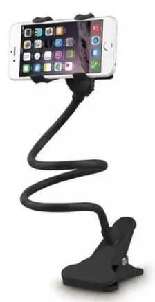
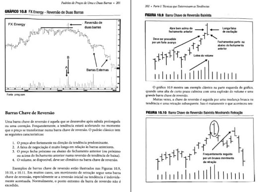
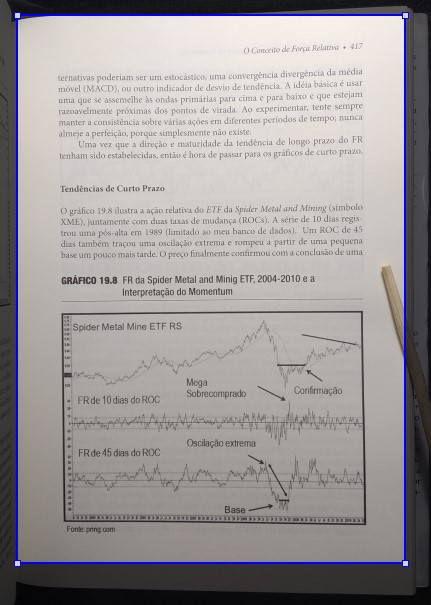
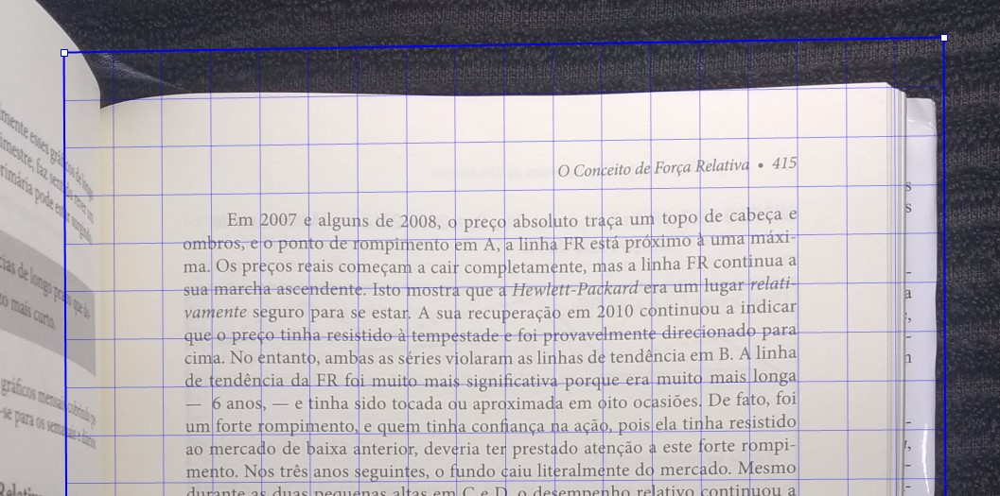
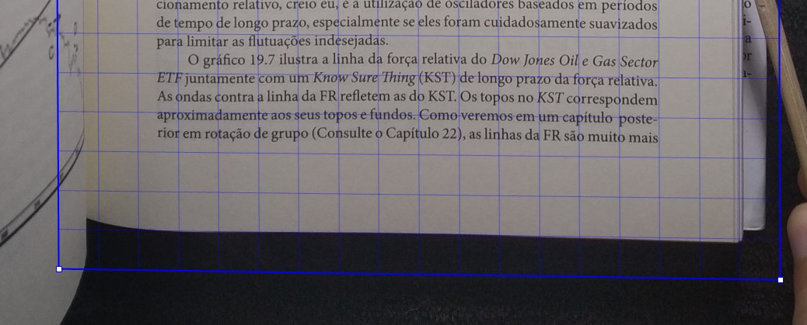
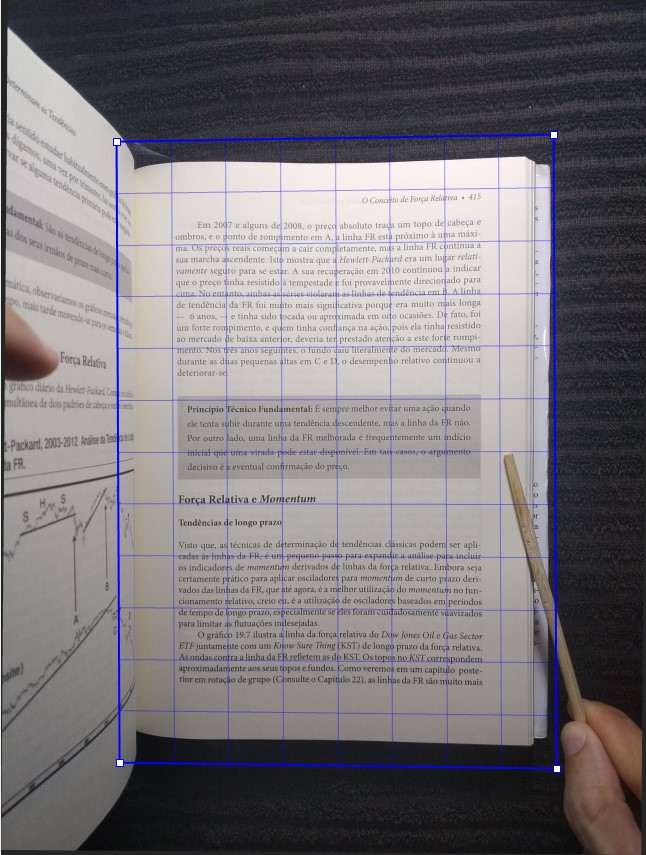

## Tutorial-Como digitalizar livros
Autor: [t.me/anonlivros](https://t.me/anonlivros)

### Menu de Navegação
1-[Introdução](#Introdução)

2-[O segredo do enquadramento perfeito](#O-segredo-do-enquadramento-perfeito)

2.1-[Perspectiva](#Perspectiva)

2.2-[Rotação](#Rotação)

3-[Tirar Fotos-Modo Páginas Contínuas](#Tirar-Fotos-Modo-Páginas-Contínuas)

4-[Tirar Fotos-Modo Duplex](#Tirar-Fotos-Modo-Duplex)

4.1-[Acelerando as fotografias](#Acelerando-as-fotografias)

4.1.1-[Disparo por sinal sonoro](#Disparo-por-sinal-sonoro)

4.1.2-[Disparo com timer automático](#Disparo-com-timer-automático)

4.1.2.1-[Configurando o timer](#Configurando-o-timer)

4.2-[Dica para aumentar a qualidade final](#Dica-para-aumentar-a-qualidade-final)

4.2.1-[Minimizar distorção das páginas](#Minimizar-distorção-das-páginas)

5-[Tratamento das fotos](#Tratamento-das-fotos)

5.1-[Modo em lotes de páginas contínuas](#Modo-em-lotes-de-páginas-contínuas)

5.2-[Modo em lotes separados em Par / Ímpar (duplex scanning)](#modo-em-lotes-separados-em-par--%C3%ADmpar-duplex-scanning)

5.2.1-[Corrigir rotação do lote de páginas Ímpar e Par com software externo](#Corrigir-rotação-do-lote-de-páginas-Ímpar-e-Par-com-software-externo)

5.3-[Edição final](#Edição-final)

5.3.1-[Tutorial em vídeo](#Tutorial-em-vídeo)

5.3.2-[Download-Software Profissional](#Download-Software-Profissional)

5.3.3-[Importação](#Importação)

5.3.3.1-[Delimitação do tamanho da task](#Delimitação-do-tamanho-da-task)

5.3.4-[Edição das fotos](#Edição-das-fotos)

5.3.5-[Definindo a resolução](#definindo-a-resolu%C3%A7%C3%A3o)

5.3.6-[Recuperar a ordem natural das páginas](#Recuperar-a-ordem-natural-das-páginas)

5.3.7-[Ativar função de pesquisa (OCR)](#ativar-fun%C3%A7%C3%A3o-de-pesquisa-ocr)

5.3.8-[Backup, Repetição e Sucesso](#backup-repeti%C3%A7%C3%A3o-e-sucesso)

6-[Salvar Ebook PDF](#Salvar-Ebook-PDF)

### Introdução
###### [[voltar]](#Tutorial-Como-digitalizar-livros)

\
Este tutorial ensina a transformar um Livro em Ebook PDF pesquisável.

Se trata de um método de baixo custo, mas que preza por qualidade e velocidade.

Não será necessário Scanner, mas só será utilizado:

- Celular
- Suporte de celular tipo '[Pescoço de Ganso](https://www.google.com/search?q=suporte+pesco%C3%A7o+de+ganso&tbm=isch)'

- Fonte de Iluminação extra
- Computador

Antes\

Depois\

No escaneamento de livros, existe o dilema envolvendo as variáveis: Qualidade x Velocidade

Para maior velocidade, perdendo qualidade de imagem, se fotografa 2 páginas por vez e posteriormente se divide a imagem na metade. Como é preciso uma boa distância entre o livro e o celular para enquadrar das duas páginas do livro, a qualidade da imagem não será tão boa. Este processo será chamado de Contínuo ao longo do tutorial.

Para maior qualidade, se fotografa uma página por vez, com maior aproximação da câmera ao livro. Em contrapartida, este processo exige um maior tempo dedicado à captura das imagens. Este processo será chamado de Duplex.

Este tutorial abordará extensivamente um modo otimizado de praticar o processo Duplex, desde a fase inicial de captura das fotos, seguindo por sua edição até gerar o ebook PDF finalizado.

Sobre a velocidade da transformação de livro de papel em Ebook PDF.

**Eficiência**
- 400 páginas leva 7 horas de trabalho, se dividindo em:
  - 2 horas para fotografar as 400 páginas;
  - 5 horas para transformar as fotos em PDF pesquisável de altíssima qualidade.

Dependendo do nível de exigência de qualidade no processo de edição gráfica, ele poderá ser terminado em 30 minutos.

**Iluminação**\
Uma fonte de iluminação extra é necessária para evitar que a sombra causada pelo celular ou uma baixa iluminação do ambiente cause distorção na imagem.

Como fonte de iluminação, pode ser utilizado o LED ligado de um outro celular ou uma [Luminária de Mesa](https://www.google.com/search?q=lumin%C3%A1ria+de+mesa&tbm=isch&).

### O segredo do enquadramento perfeito
###### [[voltar]](#Tutorial-Como-digitalizar-livros)

\
O processo de tirar fotos com um celular, ao invés de um aparelho de Scanner, está sujeito a distorções:
- de perspectiva, que impede que os ângulos internos de uma foto de um retângulo seja de 90 graus.
- de rotação, quando o livro está levemente rotacionado na mesa em relação ao celular.

Apesar de que essas distorções nas fotografias possam ser atenuadas com técnicas de edição gráfica, a qualidade final do processo será **inferior** do que seria caso a etapa de captura das fotos já fosse com enquadramento perfeito.

Um enquadramento perfeito da captura das fotos contribui imensamente para a qualidade final do ebook PDF.

Abaixo será explicado como podemos atingir este nível de qualidade.

Executar esses passos com cuidado, minimiza drasticamente o tempo necessário na edição das fotos, por reduzir o tempo gasto com configuração para compensar a distorção trapezoidal, como também o tempo gasto com ajuste de rotação das páginas.

#### Perspectiva
###### [[voltar]](#Tutorial-Como-digitalizar-livros)

\
Siga os passos:
- Instale o Android app `Angle Measurement and Accelerometer`\
https://play.google.com/store/apps/details?id=com.tksw.tksw.anglemeasurement
- Coloque o celular em cima da mesa onde o livro será fotografado. Caso o celular tenha alguma capa que desnivele a face do celular em cima da mesa, remova a capa.
- Abra o app e memorize as coordenadas X e Y que aparecem na tela do app.
- Prenda o suporte à mesa, preferencialmente próximo da quina da mesa, onde você possa manusear o livro sem inclinar o tronco ou estender os braços.
- Prenda o celular no suporte.
- Ajuste o suporte e a posição do celular nele, de modo que as coordenadas para X e Y no app, fiquem o mais próximas possíveis das coordenadas que foram memorizadas anteriormente.

Com esses passos acima, garantimos que as páginas capturadas estejam sem distorção de perspectiva, onde os ângulo internos sejam de exatos 90 graus.

#### Rotação
###### [[voltar]](#Tutorial-Como-digitalizar-livros)

\
Siga os passos:
- Abra o app da sua câmera com a opção `Linhas de Grade`ou `Grid Lines` ativada.
- Ajuste a posição do livro na mesa se guiando pelas linhas de grade.
	- De modo que o livro fique com as linhas de texto ajustadas com as linhas horizontais da grade.
	- E de modo que o livro fique centralizado na área visível da câmera.

Com esses passos acima, garantimos que:
- o livro esteja aprumado com a posição do celular e assim, as linhas sejam fotografadas perfeitamente horizontais.
- As margens verticais e horizontais dos limites da foto em relação ao livro, estejam simétricas.

### Tirar Fotos-Modo Páginas Contínuas
###### [[voltar]](#Tutorial-Como-digitalizar-livros)

\
[ em construção ]

### Tirar Fotos-Modo Duplex
###### [[voltar]](#Tutorial-Como-digitalizar-livros)

\
Para colher as duas vantagens (qualidade e velocidade) simultaneamente, recomenda-se o uso de um suporte fixo para segurar a câmera.

A técnica recomendada consiste em manter o suporte apontando a câmera apenas para a página da direita, enquadrando toda a página da forma mais próxima possível, aproximando a câmera de modo a minimizar  espaços vazios nas margens da foto.

Para facilitar a comunicação de termos, chamaremos as páginas da direita do livro como 'ímpar' e as páginas da esquerda como 'par'.

Após o devido enquadramento fixo, por estar presa no suporte, fotografar todas as páginas Ímpares sem movimentar o livro, mas somente virando as páginas.

Após o término da fotografia do lote Ímpar, recomenda-se virar o livro de ponta-cabeça (giro de 180 graus) e fotografar apenas as páginas Par. O motivo do 'giro 180 graus' é para ser possível  focalizar apenas as páginas Pares, mas sem precisar ajustar o enquadramento do suporte do celular.

Durante esse giro, reaplique a técnica de ajuste de rotação com as linhas de grade, descrito no início do tutorial.

Após girar o livro 180 graus, existe uma forma de tornar as 'viradas de páginas' mais cômodas. Recomenda-se fotografar começando da última página do livro, assim os movimentos das mãos em virar as páginas serão os mesmos em relação ao lote Ímpar.

Naturalmente, as fotografias deste lote ficarão de ponta cabeça e em ordem inversa de páginas, mas posteriormente esse efeito colateral será ajustado.

É importante lembrar para o uso de uma fonte de iluminação extra, evitando que baixa iluminação ou sombras distorçam a imagem.

#### Acelerando as fotografias
###### [[voltar]](#Tutorial-Como-digitalizar-livros)

\
Para aumentar a velocidade de captura sem precisar tocar no celular para tirar cada foto, existem abordagens distintas que podem ser seguidas.
Além do ganho de velocidade, essas abordagens aumentam a qualidade das fotos, uma vez que o toque no celular provoca tremores no suporte que podem gerar borrões na foto.

##### Disparo por sinal sonoro
###### [[voltar]](#Tutorial-Como-digitalizar-livros)

\
Esta abordagem é a mais eficiente. Mas ela só pode ser aplicada em ambientes que não sejam muito barulhentos.

- Instale o android app EasySelfie\
https://play.google.com/store/apps/details?id=com.pojkarsoft.easyselfie

O app informado possibilita tirar fotos sempre que o seu celular 'escutar' um ruído acima de um volume predeterminado. Desta forma, basta pronunciar uma sílaba em voz alta, como 'vai' ou 'pá', que o celular fará o disparo da fotografia.

Em seguida, virar a página do livro e emitir novamente o sinal sonoro para o celular tirar mais uma foto.

> Importante: Se tiver alguem no ambiente, avise do processo para não acharem que você perdeu o juízo em ficar falando 'pá-pá-pá' a cada 5 segundos. :p

A grande vantagem deste método está em o celular respeitar as variações de velocidade na sua capacidade de virar as páginas. Assim haverá uma forte sincronia entre a frequência das fotografias disparadas e seus movimentos manuais. Sem disparo no momento errado e sem tempo perdido com espera.

##### Disparo com timer automático
###### [[voltar]](#Tutorial-Como-digitalizar-livros)

\
Esta abordagem é menos produtiva que com o Disparo por Sinal Sonoro.

- Instale o android app Câmera Foto Sequência\
https://play.google.com/store/apps/details?id=com.augusto.cameratimelapse&hl=pt_BR

O app informado possibilita tirar fotos automaticamente a cada 'x' segundos, de forma que o tempo dos intervalos de captura corresponda a sua pessoal velocidade manual de trocar de páginas com segurança, minimizando os erros no processo.

###### Configurando o timer
###### [[voltar]](#Tutorial-Como-digitalizar-livros)

\
- Testar o timer de fotografia sequencial configurado para 10 segundos e ir reduzindo conforme a sua perícia em virar páginas com segurança e rapidamente.
- É importante destacar que caso o timer seja configurado para um tempo abaixo de sua habilidade manual em trocar páginas, resultará mais erros manuais. Ou seja, erros como tiragem de foto durante o manuseio das páginas. Esses erros demandam maior retrabalho de exclusão das fotos descartáveis e ocasionam no aumento do tempo investido no processo de captura. Assim, é importante configurar um tempo de captura sequencial que esteja de acordo com sua particular habilidade de virar páginas.

#### Dica para aumentar a qualidade final
##### Minimizar distorção das páginas
###### [[voltar]](#Tutorial-Como-digitalizar-livros)

\
Siga os passos:
- Para livros do tipo brochura que causa arredondamento de páginas durante sua abertura, é recomendável usar um instrumento longo e fino para pressionar as páginas fotografadas minimizando o 'arredondamento' delas durante a captura e se aproximando de um estado perfeitamente 'assentado' das páginas.
- O local indicado de pressão é a margem externa do livro, o mais longe possível de seu conteúdo.
- O instrumento para aplicar pressão pode ser improvisado com objetos como:
	- Hashi de sushi, baqueta de bateria, régua, garfo/colher (apoiando no livro com o cabo), cabo fino de pentes/escovas longas, etc...
	- Uma abordagem não recomendada seria estabilizar as páginas com os próprios dedos pressionando na margem. Mas dessa forma, aumenta a chance de gerar piores resultados durante o processamento automático de correção de distorções.

## Tratamento das fotos
### Modo em lotes de páginas contínuas
###### [[voltar]](#Tutorial-Como-digitalizar-livros)

\
[ em construção ]
- Similar ao processo duplex, com as ressalvas:
	- É necessário cortar as fotos verticalmente, na divisão das páginas.
	- Não é necessário fazer o reordenamento em modo 'duplex scanning'

### Modo em lotes separados em Par / Ímpar (duplex scanning)
###### [[voltar]](#Tutorial-Como-digitalizar-livros)

\
Este método considera que se tenha um lote de imagens apenas das páginas **ímpar** e outro lote de imagens apenas com páginas **par**.

A Eficiência Estimada do processo de edição proposto é de aproximadamente 45 segundos por página, para lotes de aproximadamente 40 páginas.

Estimativas de Eficiência no tratamento das fotos
- lote de 40 páginas (20 Ímpar + 20 par): 29 minutos
- livro de 400 páginas: 5 horas

#### Corrigir rotação do lote de páginas Ímpar e Par com software externo
[ em construção ]

### Edição final
###### [[voltar]](#Tutorial-Como-digitalizar-livros)

\
Utilizaremos o software `Abby FineReader 15 Portable` para fazer a edição final das fotos e produzir o livro em PDF.

#### Tutorial em vídeo
###### [[voltar]](#Tutorial-Como-digitalizar-livros)

\

#### Download-Software Profissional

**abby_finereader_15-portable - version 15018AFRCE**\
https://t.me/anonlivros/18

#### Importação
###### [[voltar]](#Tutorial-Como-digitalizar-livros)

\
Como o projeto de construção do PDF não será finalizado num único esforço contínuo, a atividade edição final das fotos será quebrada grupos de fotos representadas por Tasks, que facilitará a divisão de trabalho ao longo dos dias e minimizará o risco de se perder durante a organização do processo.

Siga os passos:
- Crie um novo projeto do Abbyy Finereader acessando o menu superior, seguindo os passos:
  - `File` > `New OCR Project`
- Desabilite o processamento automático de imagens, seguindo os passos:
  - `Tools` > `Options` > `Image Processing`
  - Desabilite o tickbox `Automatically process page`, confirme clicando no botão `OK`

##### Delimitação do tamanho da task
###### [[voltar]](#Tutorial-Como-digitalizar-livros)

\
Neste tutorial, será utilizado o volume de 1 task como sendo a finalização do tratamento de 40 páginas. 1 Task de 40 páginas exige por volta de 30 minutos para ser concluída.

É extremamente recomendado que o volume de páginas por task seja fixo e de número Par.

Mas será apresentado os fatores envolvidos nesta tomada de decisão.

Como as fotografias tiradas estão segmentadas em lote Ímpar e lote Par, o processo de importação também será segmentado nestes lotes.

Essa segmentação aumenta a produtividade do trabalho, uma vez que as fotografias do mesmo lote possuem a mesma posição, possibilitando aplicação de funções de tratamento em lote, dispensando o tratamento individual das fotos.

Para aumentar a consistência do processo de importação, é recomendado utilizar uma task com volume de página correspondente a um número Par.

**Maiores detalhes-O motivo do volume Par**

Com uma task com volume de páginas por lote de 40 páginas, os 2 lotes importados seriam como o abaixo.

Repare a ordem de importação necessária, sendo consistente entre as tasks em lotes de Ímpar/par, Ímpar/par.

- task 1
	- lote Ímpar-página 01 até 39
	- lote Par-páginas 02 até 40
- task 2
	- lote Ímpar-página 41 até 79
	- lote Par-páginas 42 até 80

Já para uma task de volume Ímpar, o que não é recomendado, de  25 páginas, os 2 lotes importados seriam como o abaixo.

Repare a ordem de importação necessária, não seria consistente entre as tasks, alternando de Ímpar/par, para Par/ímpar.

- task 1
	- lote Ímpar-página 01 até 24
	- lote Par-páginas 02 até 25
- task 2
	- lote Par-páginas 26 até 50
	- lote Ímpar-página 27 até 49

Com tasks de volume Ímpar, a falta de consistência no processo de importação aumenta o risco de erros de importação que geram retrabalhos para correção dos acidentes e perda de eficiência no processo.

#### Edição das fotos
###### [[voltar]](#Tutorial-Como-digitalizar-livros)

\
Tal como explicado no tópico acima, a task deve ser composta por um volume de número Par.

Considerando que as páginas iniciam com o número 1.

##### Definindo a resolução
###### [[voltar]](#Tutorial-Como-digitalizar-livros)

\
A resolução do ebook é ajustada de modo que a dimensão padronizada da página se encaixe perfeitamente na imagem dela.

**Etapa 1**
- Importe 1 única foto com texto do seu livro, arrastando o arquivo para dentro do app
- Selecione a página clicando em sua miniatura
- Clique em `Edit Image`

**Etapa 2**
- Na ferramenta `Resolution`, a defina como 200
- Acesse ferramenta `Crop` (máscara de corte)
- Escolha a opção `A4`
- Caso a máscara de corte esteja grande demais para a página, repita os passos da `Etapa 2` diminuindo a resolução
- Caso a máscara de corte esteja pequena demais para a página, repita os passos da `Etapa 2` aumentando a resolução

**A4 é o melhor formato?**

A maioria dos livros são de formato A4, mas é necessário conferir.

Ao centralizar a máscara de corte na página, caso as margens verticais estejam muito maiores que as margens horizontais, pode ser que seu livro seja de formato Carta (Letter).

Repita o processo para o padrão `Letter` e verifique se as margens verticais e horizontais ficam de tamanho mais parecido.

A opção que gerar resultados mais equilibrados, será a que deve ser usada neste livro.

No caso da página ilustrada pelas duas imagens abaixo, claramente o formato A4 gera margens verticais e horizontais mais equilibradas entre si do que o formato Letter.

A4 - Resolução 220\

Letter - Resolução 230\

Tendo encontrado a resolução e formato ideal para o formato de seu livro, guarde bem essas informaçoes pois todas as Tasks deverão ser configuradas a partir desse número de resolução e formato de página, bem como o processo de salvamento do PDF será configurado a partir dessas informações.

###### Passo a Passo

- Selecionar os arquivos correspondentes ao Lote Ímpar da Task 1
- Arrastar para dentro do app, o importando
- Para todas as páginas do lote
	- Alterar resolução para o tamanho definido no tópico anterior
	- Aplicar função: `Correct Trapezoid Distortion`
    	- Quanto melhor tiver sido o Enquadramento durante o processo de captura das fotos, menor será a nacessidade de ajuste com essa função.
    	- Altere a máscara de modo a ensinar para o app, como a página está atualmente posicionada através da representação de um retângulo distorcido.
    	- Dessa forma, é necessário simular na máscara retangular, a mesma distorção existente na página.
    	- Dicas para simular a distorçao da páginas na máscara:
        	- Verifique se a primeira linha horizontal que toca uma linha de texto, permanece perpendicular ao texto ao longo de toda a linha. Ajuste os vértices do retângulo para gerar esse enquadramento.
        	- Repita o passo acima para a última linha horizontal que toca uma linha de texto.
        	- Verifique se a linha vertical mais próxima do parágrafo da esquerda possui a mesma distâncai de margem ao longo de todo o percurso. Ajuste os vértices do retângulo para gerar esse enquadramento.
        	- Repita o passo acima para a linha vertical mais próxima do parágrafo da direita.
    	- Atentar para manter uma margem dos limites da máscara, confortavelmente maior que a necessária para fazer o Crop do formato do livro
    	- Quanto estiver satisfeito com a posição da máscara, se certifique que todas as páginas do lote estão selecionadas e confirme clicando no botão `Correct`. Desta forma a imagem será alterada de modo que o retângulo distorcido (quadrilátero), se torne um retângulo de fato, com os 4 ângulos de 90 graus. Assim, estará simulado o efeito da perspectiva perfeita, similar aos Scanners profissionais.
    	- Importante: Margem curta demais em relação a página, aumenta o risco de gerar um grave erro, impossibilitando cumprir a etapa de Crop.

Topo\

Baixo\

Página inteira\

-
	- Aplicar função: `Deskew`
	- Aplicar função: `Straighten Text Lines`
	- Selecionar função: `Crop`
    	- Definir o formato do livro encontrado na etapa anterior.
		- Centralizar a máscara de corte no conteúdo da página
		- Aplicar a função `Crop`
		- Importante: Não alinhar o Crop na borda da imagem. Esta posição no alinhamento gera um alto risco de erro na dimensão da imagem resultante, resultando em uma página com o tamanho menor que o escolhida, variando até 1 px. Caso se note que o alinhamento necessário do crop seja na borda da imagem, refaça o processo de importação das imagens, mas na etapa da função `Correct Trapezoid Distortion`, aumente a margem da seleção em relação a borda da página. para ter mais espaço de manobra no alinhamento do Crop de modo que não toque na borda da imagem.
  - Para cada página individualmente
    - Validar se há algum problema de edição.
    - Problemas e correções:
    	- Caso alguma página esteja numa situação que incapacite o crop ou esteja com grave distorção
    	- Importar a página defeituosa e repetir todo o processo exclusivamente para ela

- Repetir processo acima para o lote par

- Para ambos lotes da Task de uma única vez
	- Aplicar função: `Photo correction` > `White Background`

- Para cada página individualmente
	- Selecionar função `Erase`
		- Manualmente limpar as margens das páginas, removendo qualquer sujeira visual, como o instrumento utilizado para pressionar as páginas ou sombras.
		- Com a ferramenta, faça retângulos largos de modo que a maior área interna seja preenchida pelo fundo do livro. Se os retângulos forem pequenos e a maior parte de sua área interna for preenchida pela sujeira a ser removida, ao invés de remover a sujeira, ocasionará um efeito colateral, aparecendo um retângulo preto.

#### Recuperar a ordem natural das páginas
###### [[voltar]](#Tutorial-Como-digitalizar-livros)

Esta etapa só é necessária para fotos importadas separando em lote Ímpar e Par (duplex).

- Para ambos os lotes
	- Selecionar as páginas,
	- clicar com o botão direito numa delas,
	- clicar na opção `Reorder pages`,
	- clicar no tickbox `Restore original page order after duplex scanning`
	- clicar no botão `Ok`.

#### Ativar função de pesquisa (OCR)
###### [[voltar]](#Tutorial-Como-digitalizar-livros)

Siga os passos:
- Analisar páginas para distinguir texto de imagens
	- Selecionar todas as páginas da Task
	- Clicar no botão `Analyze Page`

- Correção da identificação do que é texto (OCR)
	- Verificar cada página para se certificar que todos os campos de texto possuem um retângulo Verde ao seu entorno
	- Caso não possua
		- deve-se o criar ao clicar no 'canto superior esquerdo' e arrastar o mouse até seu canto 'inferior direito'
		- ou deve-se alongar a área de texto já existente mais próxima

- Aplicar identificação de texto
	- Selecionar todas as páginas da Task
	- Clicar no botão `Recognize Page`

#### Backup, Repetição e Sucesso
###### [[voltar]](#Tutorial-Como-digitalizar-livros)

Durante o uso do app, seu projeto corre alguns riscos
- Eventualmente o app pode travar, o forçando a fechar e depois notar que ele não abre mais, foi corrompido.
- Acidentalmente errar na aplicação da função de reordenamento de páginas e bagunçar todo o projeto com centenas de páginas.
- Aplicar um Crop acidental incorreto para todas as páginas
- Enfim, a lista de riscos é longa...

Para minimizar o potencial de dano desses riscos ao seu projeto, é recomendado fazer um Backup sempre que uma Task for finalizada.

Para fazer Backup do seu projeto, siga os passos:
- Se for a primeira Task, save o projeto:
  - `File` > `Save OCR Project`
  - Selecione uma pasta adequada, defina um nome para seu projeto e o salve
  - Nota: Para demais tasks, não será necessário salvar o projeto manualmente, pois esse processo será automático.
- Feche o app.
- Acesse a pasta onde o projeto foi salvo
- Note que o projeto não é um arquivo, mas sim uma pasta com ícone customizado
- Faça backup dessa pasta, tirando uma cópia dela

Repita os passos do Backup sempre que finalizar uma Task, assim caso seu projeto corrompa ou sofra um grave dano, será possível recuperar o projeto estável do último Backup.

Ter Backup das últimas 2 Tasks é mais do que suficiente. Não precisa manter o backup de todas as tasks ao longo do livro. Apague os mais antigos na medida que for avançando no projeto.

O cumprimento deste contínuo processo de Backup pode ser a prática mais importante que garantirá o término do projeto com sucesso, evitando que você desista pelo caminho por causa de um acidente que o leve a jogar todo o trabalho no lixo.

## Salvar Ebook PDF
###### [[voltar]](#Tutorial-Como-digitalizar-livros)

\
Após finalizar todas as Tasks e o livro estiver finalizado no app, chegou a etapa do salvamento do Ebook em PDF.

Siga os passos:
- Na barra de opções superior, clicar em `File`
- Clicar `Save  As`
- Clicar em `Searchable PDF Document`
- Clicar em `Options...`
- Em `Image quality`, selecione `Best quality`
- Marque `Create PDF/UA (requires OCR)`
- Clique em `Use one paper size for all page images:`
    - Na caixa de seleção que será habilitada, selecione o formato da página determinado na etapa `Definindo a resolução`
- Marque `Use MRC compression (requires OCR)`
- Marque `Apply ABBYY PreciseScan to smooth characters on page images`
- Em `Searchable PDF settings`, marque `Text under the page image`
- Clique em `Edit Metadata`
- Na tela que abrir, defina informa o título do livro, autor e opcionalmente demais informações. Confirme clicando em `Ok`.
- Confirme clicando em `Ok`
- Defina o nome para o nome do arquivo PDF e clique em `Salvar`.
